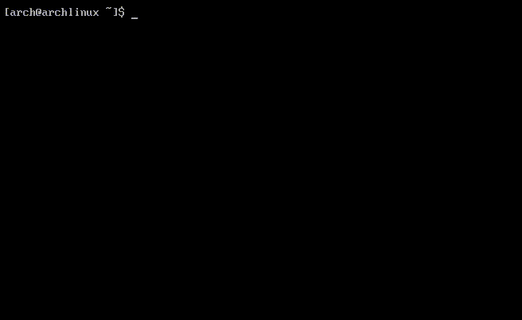

# zps [](https://github.com/orhun/zps/releases)

### A small utility for listing and reaping zombie processes on GNU/Linux.



[](https://github.com/orhun/zps/actions?query=workflow%3A%22Continuous+Integration%22)
[](https://github.com/orhun/zps/actions?query=workflow%3A%22Docker+Automated+Builds%22)
[](https://www.codacy.com/manual/orhun/zps?utm_source=github.com&utm_medium=referral&utm_content=orhun/zps&utm_campaign=Badge_Grade)
[](https://codecov.io/gh/orhun/zps)
[](https://github.com/orhun/zps/stargazers) [](./LICENSE)

On Unix and Unix-like computer operating systems, a [zombie process](https://en.wikipedia.org/wiki/Zombie_process) or defunct process is a process that has completed execution (via the [exit](<https://en.wikipedia.org/wiki/Exit_(system_call)>) system call) but still has an entry in the process table. This occurs for child processes, where the entry is still needed to allow the parent process to read its child's exit status: once the exit status is read via the [wait](<https://en.wikipedia.org/wiki/Wait_(system_call)>) system call, the zombie's entry is removed from the process table and it is said to be "reaped".

Unlike the normal processes, zombie processes cannot be removed from a system with the [kill](<https://en.wikipedia.org/wiki/Kill_(command)>) command since they are already dead. (This is where the term's metaphor [zombie - an undead person] comes from.) To reap a zombie process, `SIGCHLD` signal can be sent to the parent process manually using the [kill](<https://en.wikipedia.org/wiki/Kill_(command)>) command. If the parent process refuses to reap the zombie, then terminating the parent process (mostly with `SIGTERM` signal) can be an option. When a child process loses its parent, [init](https://en.wikipedia.org/wiki/Init) process becomes its new parent and it will reap any zombies since it executes the [wait](<https://en.wikipedia.org/wiki/Wait_(system_call)>) system call periodically.

Zombie processes are not harmful since they are not affecting other processes or using any system resources. However, they do retain their [process ID](https://en.wikipedia.org/wiki/Process_identifier). This can lead to preventing new processes to launch if all the available PIDs were assigned to zombie processes. Considering Unix-like systems have a finite number of process IDs (`/proc/sys/kernel/pid_max`), it's one of the problems that zombie processes can cause. Another danger of zombie processes is that they can cause [resource leak](https://en.wikipedia.org/wiki/Resource_leak) if they stay as a zombie in the process table for a long time. Apart from these issues, having a few zombie processes won't be a big deal for the system although they might indicate a bug with their parent process.

[zproc.c](https://github.com/orhun/zps/blob/master/example/zproc.c) file can be compiled and run to see how zombie processes are created.

```
cd example/ && gcc -O3 -Wall zproc.c -o zproc && ./zproc
```

**zps** aims to list the running processes at a particular time with stats and indicate the zombie processes on this list. It can also reap these zombie processes automatically based on the arguments provided (by default using `SIGTERM`). See [usage](https://github.com/orhun/zps#usage) for more information.
Technically, **zps** reads process stats from [/proc](https://www.tldp.org/LDP/Linux-Filesystem-Hierarchy/html/proc.html) filesystem and uses [C POSIX library](https://en.wikipedia.org/wiki/C_POSIX_library) to handle listing, sending signals and other operations.

<details>
  <summary>Table of Contents</summary>

<!-- vim-markdown-toc GFM -->

- [Installation](#installation)
  - [Arch Linux](#arch-linux)
  - [Alpine Linux](#alpine-linux)
  - [Fedora Linux](#fedora-linux)
  - [CMake](#cmake)
  - [Make](#make)
  - [GCC](#gcc)
  - [Docker](#docker)
    - [Building an image](#building-an-image)
    - [Running the image in container](#running-the-image-in-container)
- [Usage](#usage)
  - [zps -r](#zps--r--reap)
  - [zps -s](#zps--s--signal)
  - [zps -p](#zps--p--prompt)
  - [zps -q](#zps--q--quiet)
  - [zps -n](#zps--n--no-color)
- [TODO(s)](#todos)
- [License](#license)
- [Copyright](#copyright)

<!-- vim-markdown-toc -->

</details>

## Installation

### Arch Linux

```
pacman -S zps
```

### Alpine Linux

```
apk add zps
```

### Fedora Linux

```
dnf install zps
```

### CMake

```
mkdir -p build && cd build
cmake ../ -DCMAKE_INSTALL_PREFIX=/usr
make
sudo make install
sudo ldconfig
```

### Make

```
make
sudo make install
```

### GCC

With manual compilation, you might want to also pass
`-DNDEBUG` to disable runtime assertions.

```
cd src/ && gcc -s -O3 -Wall -Wextra -pedantic zps.c -o zps
```

### Docker

#### Building an image

```
docker build -f docker/Dockerfile -t zps .
```

#### Running the image in container

```
docker run zps
```

## Usage

```
Usage:
  zps [options]

Options:
  -v, --version        show version
  -h, --help           show help
  -a, --all            list all user-space processes
  -r, --reap           reap zombie processes
  -s, --signal   <sig> signal to be used on zombie parents
  -p, --prompt         show prompt for selecting processes
  -q, --quiet          reap in quiet mode
  -n, --no-color       disable color output
```

### zps -r/--reap


### zps -s/--signal


### zps -p/--prompt


### zps -q/--quiet


### zps -n/--no-color


## License

GNU General Public License v3.0 only ([GPL-3.0-only](https://www.gnu.org/licenses/gpl.txt))

## Copyright

Copyright © 2019-2024, [Orhun Parmaksız](mailto:orhunparmaksiz@gmail.com)
